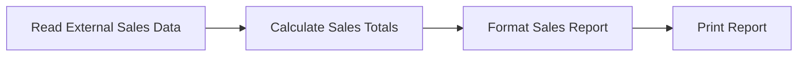
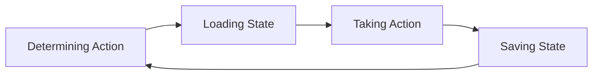

# Chapter 0: Why Use Databases?

An application needs to remember things. A shopping cart should still contain its items after the browser closes. A reservation should survive a server restart. When someone changes a pet's owner, the next person who opens that record should see the change.

In this course, we will study how modern applications use databases. We will start with a small database and connect it to a Python application. As we develop that application, we will explore different ways to represent its data and decide how much work the database should do.

## Working with External Data

You may already think of data as something outside a program. There is a spreadsheet, a file, or a table somewhere. The program reads it, does some calculations, and produces a result. That is a useful model for a report or a data analysis script.

::: {.keep-together}

### An Analytic Activity

Printing a sales report is a typical use of external data. The program might receive a file exported from a sales system, calculate totals from it, and print a report. The sales records are input to the analysis.

Each run ends with the report. We might run it again next week with a new export, but the program does not need to preserve its internal working state between runs.

:::

## Persisting Application State

An interactive application needs a broader model. Its data represents the state of the things the application works with. A pet has a name and an owner. An order contains items, and its status changes as work proceeds. These are things the program creates and changes during use.

Inside the running program, we represent those things with objects or other data structures. But objects in memory disappear when the program ends. The order still needs to exist tomorrow.

**Persistence** means keeping the relevant state beyond the lifetime of the running program. A database stores enough information for the application to recover that state when it needs it again.

We are moving from thinking of data as an external table to thinking of data as the persistent representation of internal application objects. Instead of only asking, "How do I read this data?" we also ask, "How do I preserve what this application is working with?"

The database does not need to save everything in memory. An order's contents matter after a restart. A temporary value used to draw a button probably does not. Part of our work is deciding what needs to last and how the application will retrieve and change it.

::: {.keep-together}

## Persistence Cycle

An application repeatedly determines what to do, loads the state it needs, takes action, and saves the resulting state.

**Display State** can happen anywhere in this cycle. The application might display the current state before an action, show changes as they happen, or display the saved result.

This is a conceptual cycle, not a required sequence for every request: a read-only action may load and display state without saving anything.

:::

## Why a Database?

A file can preserve data too. For a small program, that may be enough.

Applications often need more. Several people may work with the same information at once. A change may fail partway through. As the stored data grows, finding the few records needed for a particular task becomes more demanding.

A database system gives us tools for handling these problems. We still have to decide what the application should do, but we do not have to build every part of data management ourselves.

Our recurring example will be an application that manages pets and their owners. It is small enough to understand without much background, yet it raises real questions. How does the application remember who owns a pet? What should happen when an owner is removed? How does a change made through a web page become something the application remembers later?

We will develop the techniques for answering those questions as we go.

## Letting the Database Do More of the Work

Once a database holds application state, it can do more than store and return it. The application can ask the database to work with that data.

Suppose a page needs the number of dogs in the system. The application could retrieve every pet and count the dogs itself. Or it could ask the database for the count. The page needs the answer, not necessarily all the records used to calculate it.

That is the next part of our progression: deciding which work belongs in the application and which work we can give to the database system. We will begin with direct database operations, then build larger application features around them. Later chapters will examine ways to make those operations more efficient.

## Where We Are Going

We will begin with SQLite and Structured Query Language (SQL), then use Python to work with the database. Flask will give us a web interface so we can connect user actions to persistent changes.

As the application grows, we will try libraries that connect application objects to stored records in different ways. Keeping a familiar example will help us compare those approaches without having to learn a new application each time.

The later part of the course turns to document databases using Mongita and MongoDB. We will work with both hosted and local databases, then finish with geographic data and location-based questions.

Throughout the course, we will look at these tools as parts of working applications. The aim is to understand how to preserve application state and use the database effectively as the application changes.

## Chapter Outline

We will work through the following topics. Each topic may take more than one class meeting.

| Chapter | Topic | Main focus |
| --- | --- | --- |
| 0 | Why Use Databases? | Persistent application state and the division of work between application and database. |
| 1 | Intro SQL | Create and query a small SQLite database directly. |
| 2 | SQL in Python | Execute SQL from Python, retrieve results, and save changes. |
| 3 | Intro Flask | Connect database operations to web requests and forms. |
| 4 | Database Abstraction | Put data access behind functions in `database.py`. |
| 5 | Database Constraints | Enforce required values and relationships between pets and owners. |
| 6 | Object-Relational Mappers (ORMs) | Connect Python model objects to relational records. |
| 7 | ORM with Constraints | Express relationships and integrity rules through models. |
| 8 | Dataset Library | Explore dictionary-based access and automatic schema creation. |
| 9 | Optimization | Work with larger datasets, examine queries and indexes, and briefly study SQL stored procedures. |
| 10 | Intro to Mongo | Introduce document operations with Mongita. |
| 11 | Mongo App | Represent the pets-and-owners application with documents and data access functions. |
| 12 | MongoDB Atlas | Connect the application to a hosted MongoDB database. |
| 13 | Mongo Indexes | Add indexes for common application lookups. |
| 14 | Installing MongoDB Locally | Set up a MongoDB server and connect the application to it. |
| 15 | Geospatial Queries | Store locations and zones, then query their spatial relationships. |

## Questions for Thought and Study

1. How is using a database to preserve application state different from reading a table to produce a report?
2. Think of an application you use regularly. What does it need to remember after you close it?
3. Which parts of an application's state might be temporary, and which should persist?
4. Why might saving a file be enough for one application but become difficult for another?
5. In the pet-counting example, what work could the application ask the database to do?

## Further Reading

- **Databases:** An overview of databases and their role in applications.  
  <https://en.wikipedia.org/wiki/Database>
- **Persistence:** Background on keeping state beyond the lifetime of a running program.  
  <https://en.wikipedia.org/wiki/Persistence_(computer_science)>
