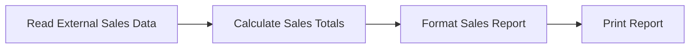
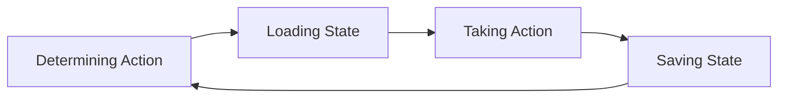

# Why Use Databases?

Modern applications and the state they need to remember

Note:
Shopping cart after closing the browser. Reservation after a server restart. A pet's new owner when someone opens the record later. Course direction: persistent application objects, then the division of work between application and database.

---

## Working with External Data

A sales export is input to an analysis.

Each run ends with the report.

Note:
Spreadsheet, file, or table supplied to a program. Sales export becomes totals and a printed report. Next week's report can use a new export without preserving the program's internal working state. This is the external-data model students may already know.

---

## Persisting Application State

Objects in memory disappear when the program ends.

**The order still needs to exist tomorrow.**

Note:
Interactive applications create and change the things they work with. Pets have owners; orders contain items and change status. Persistence keeps relevant state beyond the running process so the application can recover it. Data becomes the persistent representation of internal application objects.

---

## What Needs to Survive?

| Keep after a restart | Usually temporary |
| --- | --- |
| An order's contents | A value used to draw a button |
| A pet's owner | An intermediate calculation |

Note:
Persistence does not mean saving everything in memory. Recover enough state to continue the application's work. Order contents and pet ownership need to survive; an intermediate calculation may be temporary. Choice depends on what the application needs later.

---

## Persistence Cycle

**Display State** can happen anywhere in this cycle.

A read-only action may load and display without saving.

Note:
Conceptual cycle, not a mandatory sequence for every request. Determine the requested action, load relevant state, act, save changes. Display can precede an action, show changes during it, or show the saved result. Read-only requests may omit saving.

---

## Why Not Just a File?

A file may be enough for a small program.

- Several people change the same information.
- A change fails partway through.
- Finding the needed records gets harder as data grows.

Note:
A database supplies tools for shared state, failure handling, and finding records. The application still needs a defined outcome for its operations. Mechanisms come in later chapters.

---

## Pets and Owners

How does the application remember who owns a pet?

What happens when an owner is removed?

How does a web-page change become persistent?

Note:
Recurring application through the course. Familiar domain with real relationships and changes. The same example lets us compare data access approaches without relearning the application each time.

---

## Letting the Database Do More

The page needs the number of dogs.

| Application counts | Database counts |
| --- | --- |
| Retrieve every pet | Request the count |
| Count dogs in the application | Receive the result |

Note:
The page needs the answer, not necessarily all the records behind it. Database work goes beyond storage. Where an operation belongs depends on the application's needs. Optimization details come later.

---

## Course Outline: SQL and the Application

Structured Query Language (SQL)

| Chapter | Topic |
| --- | --- |
| 1 | Intro SQL |
| 2 | SQL in Python |
| 3 | Intro Flask |
| 4 | Database Abstraction |
| 5 | Database Constraints |

Note:
SQLite first. Python connects program behavior to the database. Flask connects user actions to persistent changes. Data access functions in database.py separate those operations from the interface. Constraints add rules for valid stored state.

---

## Course Outline: Data Access and Optimization

Object-relational mapper (ORM)

| Chapter | Topic |
| --- | --- |
| 6 | Object-Relational Mappers (ORMs) |
| 7 | ORM with Constraints |
| 8 | Dataset Library |
| 9 | Optimization |

Note:
Different libraries connect application objects to stored records. Familiar pets-and-owners example throughout. Optimization includes larger datasets, queries and indexes, and a brief look at SQL stored procedures.

---

## Course Outline: Document Databases

| Chapter | Topic |
| --- | --- |
| 10 | Intro to Mongo |
| 11 | Mongo App |
| 12 | MongoDB Atlas |
| 13 | Mongo Indexes |
| 14 | Installing MongoDB Locally |
| 15 | Geospatial Queries |

Note:
Mongita introduces document operations locally. MongoDB Atlas and a local MongoDB server extend the application to different deployment settings. Geographic data and location questions finish the sequence. A topic can span more than one class meeting.

---

## An Application You Use

What should it remember after you close it?

What can it forget?

What work could its database do?

Note:
Return to persistent application state and the division of work. Shopping cart, reservation, or another familiar application. Identify what must survive before choosing how to store it. The sales report remains a useful comparison: external input to a run versus state carried between interactions.
